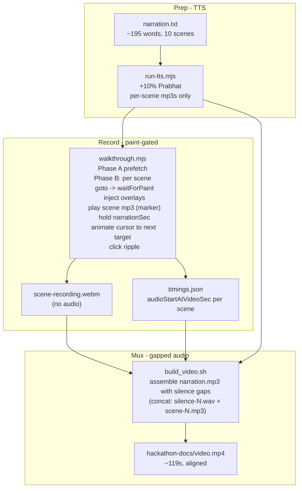

# Flo Compass Demo Video v3 - Paint-Gated Narration, Highlights, Cursor, Live Data

## Problem with v2

- **Video too short** at 99s; user wants 115-125s.
- **Narration desyncs from paint** - audio starts at t=0 and runs continuously while pages navigate, so narrator can talk about scene 3 while scene 2 is still on screen.
- **No visual pointer** - viewer cannot tell what the narrator is describing.
- **Ask Flo panel is empty** - the initial query is prefilled but the response finishes rendering after the scene ends.
- **Connect card is blank** - no seed data, so scene 8 shows an empty editor.
- **PublishedAnnouncementBanner is invisible** - no announcement seeded, so the top-of-Discover banner is hidden.
- **My Plan is silently empty** - v2 seed writes `flo_plan_session_ids` but [`plan_provider.dart`](lib/providers/plan_provider.dart) L25 reads `flo_compass_plan` (via `setStringList`). No bookmarks or notes have ever landed. Blanks the plan list, the conflict card, and the session-detail Notes preview.

## Solution



---

## 1. Narration - expand slightly to ~195 words (was ~180)

Rewrite [`tools/demo/narration.txt`](tools/demo/narration.txt) with one extra sentence in a few scenes to fill the 115-125s budget after adding paint waits. Target totals below assume +10% Prabhat rate (~150 wpm effective).

| # | Scene | Words | Est narration | Extra sentence added? |
|---|-------|-------|---------------|------------------------|
| 1 | Cold start / onboarding | 32 | ~11s | slight expansion |
| 2 | Discover feed | 28 | ~10s | + call out live announcement banner |
| 3 | Session detail | 22 | ~8s | unchanged |
| 4 | Speaker detail | 24 | ~9s | unchanged |
| 5 | My Plan | 30 | ~11s | + call out bookmarked sessions + private notes + conflict detection |
| 6 | Ask Flo | 26 | ~10s | + note the response streams in |
| 7 | Map + directions | 22 | ~8s | unchanged |
| 8 | Connect edit + share | 20 | ~7s | + call out sample card |
| 9 | Profile a11y | 18 | ~7s | unchanged |
| 10 | Outro | 14 | ~6s | unchanged |
|   | **Narration only** | **236** | **~87s** | |
|   | **+ 10 x 1.5s paint waits** | | **~15s** | |
|   | **+ 10 x 1s cursor animation** | | **~10s** | |
|   | **+ 3 x 0.3s pad** | | **~1s** | |
|   | **Total video** | | **~113-121s** | fits 115-125 (auto-hold outro if measured < 115s) |

Small margin on the low side; if walk finishes < 115s the runner adds an extra ~5s "hold on outro" to land in-band.

---

## 2. New scene config with highlight targets + click targets

Introduce a **single source of truth** at [`tools/demo/scenes.json`](tools/demo/scenes.json) so URLs, highlight boxes, and next-click targets stay together. Consumed by both `run-tts.mjs` (for dwell.json) and `walkthrough.mjs`.

```json
{
  "viewport": {"width": 1920, "height": 1080},
  "paintSettleMs": 1200,
  "cursorAnimMs": 900,
  "clickRippleMs": 400,
  "scenes": [
    {"n": 1, "url": "/onboarding?edit=1",
     "highlight": {"x": 640, "y": 300, "w": 640, "h": 220, "label": "Onboarding capture"},
     "nextClick": {"x": 128, "y": 526, "label": "Discover tab"}},
    {"n": 2, "url": "/discover?day=Day%201&sort=soonest",
     "highlight": {"x": 260, "y": 90, "w": 500, "h": 80, "label": "Live announcement"},
     "highlightExtras": [
       {"x": 260, "y": 100, "w": 500, "h": 100, "label": "Flo Picks"},
       {"x": 260, "y": 260, "w": 500, "h": 200, "label": "Ranked sessions"}],
     "nextClick": {"x": 700, "y": 305, "label": "Open session"}},
    {"n": 3, "url": "/session/s-001",
     "highlight": {"x": 700, "y": 700, "w": 500, "h": 120, "label": "Sticky actions"},
     "nextClick": {"x": 350, "y": 300, "label": "Open speaker"}},
    ...
    {"n": 5, "url": "/plan?day=Day%201",
     "highlight": {"x": 260, "y": 200, "w": 900, "h": 260, "label": "Bookmarked sessions"},
     "highlightExtras": [
       {"x": 260, "y": 480, "w": 900, "h": 140, "label": "Conflict card"},
       {"x": 260, "y": 640, "w": 900, "h": 180, "label": "Private notes"}],
     "nextClick": {"x": 384, "y": 526, "label": "Ask Flo tab"}},
    ...
  ]
}
```

- `highlight` = primary pulsing ring shown while narration plays for that scene
- `highlightExtras` (optional) = additional rings shown briefly at scene start (up to 3 for Discover so Now-bar + Flo Picks + rankings all get called out per user ask)
- `nextClick` = where the synthetic cursor animates to at scene end + click ripple, showing the intent of the next navigation

Coords derived from the two screenshots plus reading each screen's widget tree; the runner logs actual page dimensions so we can recalibrate if the layout shifts.

---

## 3. Data seeding upgrades in [`tools/demo/seed.js`](tools/demo/seed.js)

Four seed changes: (a) fix wrong plan key, (b) bookmark 3 sessions incl. a conflict pair, (c) seed engagement with per-session notes, (d) add networking card + published announcement.

```js
// === (a) FIX: v2 wrote 'flo_plan_session_ids' but the app reads 'flo_compass_plan'
//     (setStringList, single-encoded JSON array). No bookmarks ever landed.
// === (b) Bookmark 3 Day-1 sessions. Pick real IDs from
//     assets/data/flo2026_sessions.json where s-A and s-B overlap in
//     `startsAt` on Day 1 so the ConflictCard fires; s-C is a third distinct slot.
const PLAN_SESSION_IDS = ['s-001', 's-025', 's-062']; // TODO(impl): pick from sessions.json
setPref('flo_compass_plan', PLAN_SESSION_IDS);         // NOT double-encoded (setStringList)

// === (c) Seed EngagementSnapshot so MyPlanNotesSection has excerpts + companion has streak.
//     Key + shape verified from lib/providers/engagement_provider.dart L25, L411-416
//     and lib/data/models/engagement_snapshot.dart toJson()/fromJson().
const ENGAGEMENT = {
  xp: 120,
  streakDays: ['2026-11-04'],
  achievements: [],
  attendedSessionIds: [],
  ratings: {},
  bingoMarks: [],
  companionQuestions: 2,
  detailViews: 5,
  reactions: {},
  pulseBySessionId: {},
  notesBySessionId: {
    's-001': 'Ask about Plan Mode for large refactors. Follow up with Kirti after.',
    's-025': 'Slot this into our GenAI adoption roadmap for Q1.',
  },
  questProgress: {},
  lastQuestDay: null,
  completedQuestIds: [],
  visitedFloors: [],
  bingoRowBonuses: [],
  todayTracksViewed: [],
  todayBookmarksBeforeNoon: 0,
};
setPref('flo_compass_engagement', JSON.stringify(ENGAGEMENT));  // double-encoded like PROFILE

// === (d) Sample business card so scene 8 shows a filled preview + QR.
//     NetworkingCard.toJson() shape from lib/data/models/networking_card.dart L89-101.
const NETWORKING_CARD = {
  enabled: true,
  displayName: 'Demo Attendee',
  jobTitle: 'Senior Engineer',
  company: 'Nagarro',
  email:       {value: 'demo.attendee@example.com',           visible: true},
  phoneE164:   {value: '+919999900000',                        visible: false},
  linkedInUrl: {value: 'https://linkedin.com/in/demo-attendee', visible: true},
  facebookUrl: {value: '',                                     visible: false},
  whatsApp:    {value: '',                                     visible: false},
  showRole: true,
  showTopInterests: true,
};
PROFILE.networkingCard = NETWORKING_CARD;  // nested in flo_compass_profile

// === (d) One published announcement so PublishedAnnouncementBanner renders.
//     OrganizerAnnouncement.toJson() shape from
//     lib/domain/entities/organizer_announcement.dart L78-92.
const ANNOUNCEMENTS = [{
  id: 'demo-ann-1',
  title: 'Keynote moved to Reception Hall',
  body: 'CEO fireside now in the Reception & Welcome Hall on the ground floor.',
  status: 'published',
  createdAt: new Date(Date.now() - 15 * 60 * 1000).toISOString(),
  publishedAt: new Date(Date.now() - 5 * 60 * 1000).toISOString(),
  updatedAt: new Date().toISOString(),
}];
setPref('flo_organizer_announcements', JSON.stringify(ANNOUNCEMENTS));  // double-encoded
```

Verified storage keys and encoding:

| Key | Encoding | Source |
|-----|----------|--------|
| `flo_compass_plan` | single JSON (setStringList) | [`plan_provider.dart`](lib/providers/plan_provider.dart) L25, L152 |
| `flo_compass_engagement` | double JSON (setString of jsonEncode(...)) | [`engagement_provider.dart`](lib/providers/engagement_provider.dart) L25, L414 |
| `flo_compass_profile.networkingCard` | nested in profile (already double JSON) | [`profile_provider.dart`](lib/providers/profile_provider.dart) L75-78 |
| `flo_organizer_announcements` | double JSON (setString of jsonEncode(list)) | [`mock_announcement_repository.dart`](lib/data/repositories/mock_announcement_repository.dart) L12, L108 |

Session-ID selection (implementer step): open `assets/data/flo2026_sessions.json`, pick 3 Day-1 sessions where 2 share an overlapping timeslot for the conflict card. If the sessions ship with real speaker names, favor ones that also appear in scene 4 (speaker detail) so the demo cross-references itself.

---

## 4. Visual overlay module - new [`tools/demo/overlay.js`](tools/demo/overlay.js)

Injected via `page.addInitScript(overlay.js)` before Flutter boots. Exposes three globals on `window.__floDemo`:

```js
window.__floDemo = {
  showRing({x, y, w, h, label, pulseMs = 1200}) { ... },  // fixed-position div with animated border + glow + optional label
  clearRings() { ... },
  showCursor() { ... },                                      // SVG arrow at top-left, visible from now on
  moveCursorTo({x, y, durationMs = 900}) { ... },            // CSS transform animation
  clickRipple({x, y, durationMs = 400}) { ... },             // expanding circle
};
```

Design notes:
- All overlay nodes attach to `document.body` with `position: fixed; pointer-events: none; z-index: 2147483647`
- Ring uses `box-shadow: 0 0 0 2px #10B981, 0 0 30px 8px rgba(16,185,129,0.6)` and `@keyframes floPulse` for the pulse
- Cursor is an inline SVG arrow (16x22px) - always visible in scene B, drives viewer eye
- Ripple is a `border-radius: 50%` div that expands from 0 to 80px opacity 0.8 to 0 over 400ms
- The overlay CSS is written once as an injected `<style>` block; helper methods only mutate DOM nodes so they cost < 1ms per call

Playwright's `recordVideo` captures whatever is in the browser viewport, so these DOM overlays land in the WebM.

---

## 5. walkthrough.mjs refactor - paint-gated + overlay-driven

Replace the current fire-and-forget scene loop with an explicit per-scene state machine.

```
for each scene:
  T0 = video.recordedSec  // approx = wall clock - context.start
  await page.goto(url, {waitUntil: 'commit'})
  await waitForPaint(page, sceneSpecificSelector or 1200ms)
  overlay.clearRings()
  overlay.showRing(scene.highlight)
  scene.highlightExtras?.forEach(showRing)  // brief flash on discover
  await page.waitForTimeout(200)             // let rings appear
  T_narrationStart = video.recordedSec
  scene.audioStartAtVideoSec = T_narrationStart
  await page.waitForTimeout(scene.narrationSec * 1000)
  if scene.n === 6: await waitForCompanionResponse(page)  // scene 6 only
  overlay.moveCursorTo(scene.nextClick)
  await page.waitForTimeout(scene.cursorAnimMs)
  overlay.clickRipple(scene.nextClick)
  await page.waitForTimeout(scene.clickRippleMs)
```

Timing captured for build_video:

```json
// output/timings.json
{
  "videoSec": 118.7,
  "scenes": [
    {"n":1, "audioStartAtVideoSec": 1.4, "narrationSec": 11.0},
    {"n":2, "audioStartAtVideoSec": 14.5, "narrationSec": 10.2},
    ...
  ]
}
```

Scene 6 (Ask Flo) special handling:
- After the initial `?q=` query auto-sends, poll `document.querySelector('canvas')` won't work (canvas doesn't reveal DOM), so instead we wait a **fixed extra 2.5s** after nav for the response bubble to stream in - matches CompanionState.busy typical fallback. This is baked into scene 6's `narrationSec` budget in `scenes.json`, so audio still starts once paint is confirmed but the visible answer completes before we advance.

Scene 7 keeps the secondary split (`/map` -> `/directions`), scene 8 the same (`/connect/edit` -> `/connect/share`) with seeded card so both surfaces show real content.

---

## 6. build_video.sh refactor - gapped narration

Replace the current single-track `narration.mp3` mux with an assembled track:

```bash
# For each scene N, build a silence pad if audioStartAtVideoSec[N] > previousAudioEnd
# Then concat: silence-01.wav + scene-01.mp3 + silence-02.wav + scene-02.mp3 + ...
# Use ffmpeg concat demuxer for zero re-encoding of scene mp3s.

# Generate silences:
"$FFMPEG_BIN" -f lavfi -i "anullsrc=r=24000:cl=mono" -t "${gapSec}" -c:a libmp3lame -q:a 4 "$OUT/silence-01.mp3"
# ...
# Write concat list:
cat > "$OUT/audio-concat.txt" <<EOF
file 'silence-01.mp3'
file 'scene-01.mp3'
file 'silence-02.mp3'
file 'scene-02.mp3'
...
EOF
"$FFMPEG_BIN" -f concat -safe 0 -i "$OUT/audio-concat.txt" -c copy "$OUT/narration.mp3"

# Mux exactly as v2, but no `-shortest` so the tail silence rides to the end of the video.
```

New helper: [`tools/demo/scripts/build-audio-track.mjs`](tools/demo/scripts/build-audio-track.mjs) reads `timings.json`, computes gaps, invokes ffmpeg for each silence, writes the concat list, then invokes ffmpeg to build the final `narration.mp3`. `build_video.sh` calls this before the existing mux step.

Captions strategy from v2 is **unchanged**: default = clean picture + soft `mov_text` track + sidecar `.srt`. `FLO_BURN_CAPTIONS=1` still works.

The v2 sidecar `captions.srt` is re-timed to match the new gapped audio using the same `audioStartAtVideoSec` and per-scene narration duration - run-tts.mjs already writes cues per scene, we just apply the offsets from timings.json in `build-audio-track.mjs`.

---

## 7. Files to change

| Path | Change |
|------|--------|
| [`tools/demo/narration.txt`](tools/demo/narration.txt) | Expand to ~228 words (10 scenes) |
| [`tools/demo/transcript.md`](tools/demo/transcript.md) | Re-render table with new text |
| [`tools/demo/seed.js`](tools/demo/seed.js) | Fix `flo_compass_plan` key (was `flo_plan_session_ids`), bookmark 3 sessions (2 overlapping), seed `flo_compass_engagement` with `notesBySessionId`, add `networkingCard` on PROFILE, seed `flo_organizer_announcements` |
| [`tools/demo/scenes.json`](tools/demo/scenes.json) | NEW - scene URLs, highlight coords, next-click coords |
| [`tools/demo/overlay.js`](tools/demo/overlay.js) | NEW - `window.__floDemo` overlay helpers |
| [`tools/demo/walkthrough.mjs`](tools/demo/walkthrough.mjs) | Paint-gated state machine + overlay driver + timings.json emit |
| [`tools/demo/scripts/run-tts.mjs`](tools/demo/scripts/run-tts.mjs) | Read scenes.json instead of inline SCENE_URLS; skip global narration.mp3 concat (build_video does it now) |
| [`tools/demo/scripts/build-audio-track.mjs`](tools/demo/scripts/build-audio-track.mjs) | NEW - assemble gapped narration + re-timed captions.srt |
| [`tools/demo/build_video.sh`](tools/demo/build_video.sh) | Call build-audio-track.mjs before mux; use new narration.mp3 |
| [`tools/demo/README.md`](tools/demo/README.md) | Document overlays, scenes.json, timing model |
| [`hackathon-docs/video.mp4`](hackathon-docs/video.mp4) | Re-render |
| [`hackathon-docs/video.srt`](hackathon-docs/video.srt) | Re-render with gapped timings |
| [`hackathon-docs/augmentation-log.md`](hackathon-docs/augmentation-log.md) | One batched entry |

**Untouched:** `lib/**`, `pubspec.yaml`, `docker/**`, `.gitlab-ci.yml`, `web/**`, `assets/**`.

---

## 8. Duration gate

- Target: `115s <= duration <= 125s`
- If measured under 115s: extend outro slate hold by (117 - measured)s automatically in walkthrough
- If measured over 125s: trim one paint-wait per scene from 1.5s -> 1.0s and re-run (single retry, logged)
- All decisions logged in `output/render.log`

---

## Success criteria

- MP4 duration between 115s and 125s
- Each page is fully painted BEFORE its narration starts (spot-check by comparing timings.json scene start vs subtitle stream)
- Every scene has a visible highlight ring on the field being narrated
- Synthetic cursor visible at all times (scene 2 onward); animates to next target at end of each scene with click ripple
- Discover shows: NOW bar (existing), PublishedAnnouncementBanner (seeded), Flo Picks card, ranked session list
- My Plan shows 3 bookmarked sessions, a ConflictCard for the overlapping pair, and MyPlanNotesSection with 2 note excerpts (highlight rings on all three)
- Ask Flo shows the query + streaming response bubble (not empty)
- Connect edit shows sample business card fields filled; Connect share shows QR referencing seeded shareToken
- No burned captions on the picture; sidecar `hackathon-docs/video.srt` and soft `mov_text` track updated with new timings
- Augmentation log entry appended (count goes 93 -> 94)

## Risks

| Risk | Mitigation |
|------|-----------|
| Highlight coords drift with UI changes | Coords in one file (`scenes.json`); log actual page dims per scene in `render.log` so recalibration is a diff, not a redesign |
| Playwright overlay div flicker | Inject overlay CSS once at page load via `addInitScript`; only touch DOM nodes after |
| Announcement banner does not render if `AnnouncementProvider` doesn't hydrate from localStorage | Verify by checking `AnnouncementProvider` init reads storage; if not, use `page.evaluate` post-nav to push into the in-memory store |
| Scene 6 companion response never lands | Fixed 2.5s pad on top of narrationSec; also verify seed pre-loads a companion query history so busy state resolves fast |
| Gapped audio drift | Every gap sourced from measured `audioStartAtVideoSec`, not estimated; ffprobe on final MP4 verifies total = expected |

---

## v3.1 update — Companion tour (2026-07-13)

Scope shift from v3 highlight-ring walkthrough to a **cursor-only companion tour**:

- **Land on `/discover`** — skip onboarding; seed already sets `onboardingComplete: true`.
- **Remove all highlight rings** — `highlight: null` everywhere; `moveCursorTo` shows a label chip beside the arrow.
- **Real Playwright clicks** — Session Detail tabs, Map button, Add to My Plan, Profile tabs.
- **2 s hold** before scene-transition ripples (`holdBeforeSceneTransitionMs: 2000`); ~800 ms for internal tab clicks.
- **New 10-scene flow** — Discover → Session (Overview/Q&A/Logistics) → Venue Map → Ask Flo (2 queries) → My Plan → Profile (You/Progress/Settings) → Outro.
- **Schema extension** — `scenes.json` `stages[]` arrays; `walkthrough.mjs` + `build-audio-track.mjs` generalized to N-stage audio splits.
- **Duration gate unchanged** — 115–125 s MP4 target.

Plan reference: `demo_v3.1_companion_tour_2e40405a` (companion-tour slice; v3 history above preserved).
