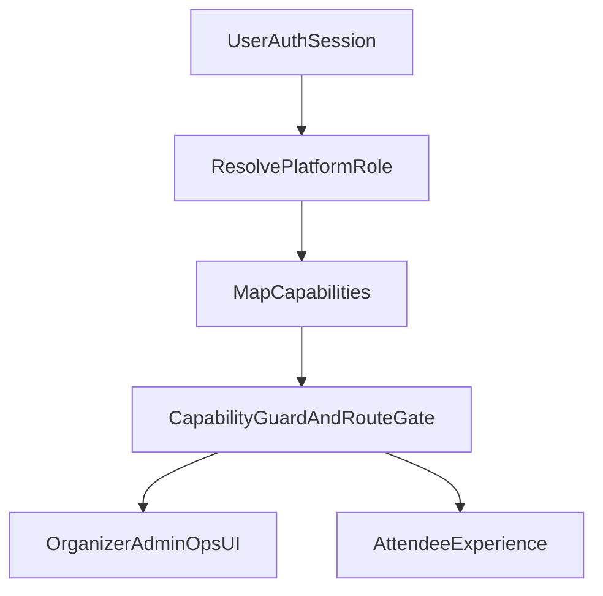

# Platform Roles Modes Implementation Plan

## Goal
Implement platform-level modes for `attendee`, `organizer`, and `admin` while preserving current attendee personalization and Accelevents boundaries.

This plan treats organizer/admin as **RBAC for Flo overlay operations** (Q&A moderation, announcements, prompt curation, feature flags), not official agenda CRUD.

## Current Baseline (to build on)
- Capability checks already exist via [`lib/core/auth/app_capability.dart`](c:/Nagarro/ai-avengers/lib/core/auth/app_capability.dart) and [`lib/shared/auth/capability_guard.dart`](c:/Nagarro/ai-avengers/lib/shared/auth/capability_guard.dart).
- Auth is optional and governed by runtime config in [`lib/core/config/runtime_config.dart`](c:/Nagarro/ai-avengers/lib/core/config/runtime_config.dart) and architecture notes in [`docs/architecture/auth-and-consent.md`](c:/Nagarro/ai-avengers/docs/architecture/auth-and-consent.md).
- Attendee persona role already exists in [`lib/data/models/user_profile.dart`](c:/Nagarro/ai-avengers/lib/data/models/user_profile.dart) (`AttendeeRole`) and must remain separate from platform roles.
- Session Q&A infrastructure exists in [`lib/domain/entities/session_qa.dart`](c:/Nagarro/ai-avengers/lib/domain/entities/session_qa.dart), [`lib/data/repositories/mock_session_qa_repository.dart`](c:/Nagarro/ai-avengers/lib/data/repositories/mock_session_qa_repository.dart), and [`lib/features/session_detail/widgets/session_qa_section.dart`](c:/Nagarro/ai-avengers/lib/features/session_detail/widgets/session_qa_section.dart).

## Product Boundary Guardrails
- Keep out of scope: official agenda CRUD, registration, ticketing, check-in, badge printing, attendee management owned by Accelevents.
- Organizer/Admin in Flo only manage overlay intelligence and moderation data.

## Role Model (target)
- `AttendeeRole` (existing): personalization persona.
- `PlatformRole` (new): `attendee`, `organizer`, `admin` for operations rights.
- Capabilities derive from `PlatformRole` + `auth.enabled` state.

## Phase A (branch-ready) - RBAC scaffold + Q&A moderation MVP

### A1. Add platform role and claims mapping
- Add `PlatformRole` model (new): [`lib/core/auth/platform_role.dart`](c:/Nagarro/ai-avengers/lib/core/auth/platform_role.dart).
- Extend auth session with platform role metadata in [`lib/core/auth/auth_session.dart`](c:/Nagarro/ai-avengers/lib/core/auth/auth_session.dart).
- Update token parsing and fallback logic in [`lib/core/auth/auth_service.dart`](c:/Nagarro/ai-avengers/lib/core/auth/auth_service.dart) to resolve role from claims/allowlist.

### A2. Expand capability system
- Extend [`lib/core/auth/app_capability.dart`](c:/Nagarro/ai-avengers/lib/core/auth/app_capability.dart) with:
  - `moderateQa`
  - `publishAnnouncement`
  - `manageOpsConfig`
- Update `AuthService.hasCapability(...)` mapping for attendee/organizer/admin.
- Keep existing capabilities (`earnXp`, `registerEvent`, `attributedFeedback`) behavior intact.

### A3. Add route/UI gating entry points
- Add operations route constants in [`lib/core/routing/app_routes.dart`](c:/Nagarro/ai-avengers/lib/core/routing/app_routes.dart):
  - `/organizer`
  - `/admin`
- Gate routes in [`lib/routing/app_router.dart`](c:/Nagarro/ai-avengers/lib/routing/app_router.dart) with capability checks and redirect to safe page when denied.
- Add lightweight entry from Profile screen (visible only when allowed) in [`lib/features/profile/profile_screen.dart`](c:/Nagarro/ai-avengers/lib/features/profile/profile_screen.dart).

### A4. Organizer Q&A moderation MVP (overlay only)
- Add moderation actions to Session Q&A domain/repo for organizer mode:
  - mark answered
  - pin/unpin
  - hide/unhide
- Touch points:
  - [`lib/domain/entities/session_qa.dart`](c:/Nagarro/ai-avengers/lib/domain/entities/session_qa.dart)
  - [`lib/domain/repositories/session_qa_repository.dart`](c:/Nagarro/ai-avengers/lib/domain/repositories/session_qa_repository.dart)
  - [`lib/data/repositories/mock_session_qa_repository.dart`](c:/Nagarro/ai-avengers/lib/data/repositories/mock_session_qa_repository.dart)
  - [`lib/providers/session_qa_provider.dart`](c:/Nagarro/ai-avengers/lib/providers/session_qa_provider.dart)
  - [`lib/features/session_detail/widgets/session_qa_section.dart`](c:/Nagarro/ai-avengers/lib/features/session_detail/widgets/session_qa_section.dart)
- Keep attendee ask/reply/upvote flow unchanged.

### A5. Runtime config and mock role bootstrapping
- Add dev-only mock role override (e.g., dart-define or config key) via:
  - [`lib/core/config/runtime_config.dart`](c:/Nagarro/ai-avengers/lib/core/config/runtime_config.dart)
  - [`assets/config/config.dev.json`](c:/Nagarro/ai-avengers/assets/config/config.dev.json)
- Ensure prod profile remains safe default attendee-only.

### A6. Tests and validation for Phase A
- Unit tests:
  - role resolution and capability matrix (`auth_service`)
  - moderation transitions in Q&A provider/repository
- Widget tests:
  - organizer/admin controls visible only with capability
  - denied routes redirect correctly
- Run WSL Tier 1 after implementation.

## Phase B (later) - Organizer overlays beyond Q&A
- Add organizer announcements workflow (compose/publish/archive) with mock-first repository.
- Add prompt-curation screen for predefined session prompts used by Q&A/Companion.
- Add small organizer dashboard (counts: pending Q&A, hidden posts, recent announcements).

## Phase C (later) - Admin operations
- Add admin roster/role assignment UI backed by mock allowlist first.
- Add feature-flag management view for event-level ops controls.
- Add audit trail records for moderation and ops actions (mock log first).

## Phase D (later/platform) - Read-only external integration
- Add read-only adapter contract for external event systems (Accelevents/Eventbrite/etc.).
- Organizer/admin surfaces edit only Flo overlays, never canonical session records.

## Deliverables to save during grooming
- Add idea entry in [`docs/plans/Ideas/08-platform-multi-event.md`](c:/Nagarro/ai-avengers/docs/plans/Ideas/08-platform-multi-event.md) (next `IDEA-PE-011`).
- Add backlog item [`docs/plans/backlog/platform-roles-rbac.md`](c:/Nagarro/ai-avengers/docs/plans/backlog/platform-roles-rbac.md) with promotion criteria.
- Update [`docs/plans/Ideas/README.md`](c:/Nagarro/ai-avengers/docs/plans/Ideas/README.md) index/counts once idea is added.

## Phase A Acceptance Criteria
- Platform role model exists and is independent from `AttendeeRole`.
- Capability checks enforce organizer/admin visibility and route access.
- Organizer can moderate Q&A overlays (answered/pin/hide) in UI.
- Attendee experience remains unchanged for discover/companion/my-plan flows.
- Tier 1 passes in WSL with updated tests.

## Explicit Non-Goals
- No official agenda CRUD.
- No registration/check-in/ticketing/badge features.
- No attendee directory management.
