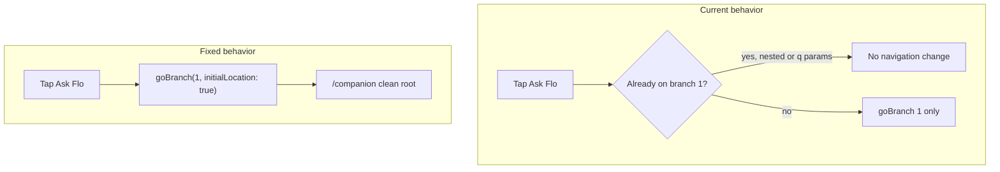

# Shell tab reset for Ask Flo and My Plan

## Problem

[`lib/features/shell/main_shell.dart`](lib/features/shell/main_shell.dart) only resets navigation for **Discover** (index 0). Ask Flo and My Plan call `shell.goBranch(index)` with no `initialLocation: true`, so re-tapping the active tab is a no-op when:

- Nested routes are open (session detail, directions, map — all live on the Discover branch)
- Ask Flo was opened with query params (`/companion?q=...`) or stacked via `push`
- The companion branch navigator has stacked pages



## Implementation

### 1. Update `_onTabSelected` in main_shell.dart

File: [`lib/features/shell/main_shell.dart`](lib/features/shell/main_shell.dart) (lines 206–236)

Replace the fallback `shell.goBranch(index)` with explicit handling:

| Tab | Index | Action on every tap |
|-----|-------|-------------------|
| Discover | 0 | **unchanged** — reset when not on `/discover`; double-tap scroll-to-top when on feed |
| Ask Flo | 1 | `shell.goBranch(1, initialLocation: true)` — always land on clean `/companion` (clears `?q=` / `?sessionId=` and pops stacked companion pages) |
| My Plan | 2 | `shell.goBranch(2, initialLocation: true)` — always land on `/my-plan` |
| Profile | 3 | keep `shell.goBranch(3)` for now (out of scope; single route, no reported issue) |

Sketch:

```dart
if (index == 1) {
  _lastDiscoverTap = null;
  shell.goBranch(1, initialLocation: true);
  return;
}
if (index == 2) {
  _lastDiscoverTap = null;
  shell.goBranch(2, initialLocation: true);
  return;
}
_lastDiscoverTap = null;
shell.goBranch(index);
```

No provider changes — chat history in `CompanionState` is intentionally preserved (navigation-only reset per your choice).

### 2. Add widget tests

Extend [`test/features/discover_navigation_test.dart`](test/features/discover_navigation_test.dart) (reuse existing shell fixture + session data):

| Test | Steps | Assert |
|------|-------|--------|
| Ask Flo from nested session | `router.go('/session/s-001')` → tap **Ask Flo** | `uri.path == /companion`, query empty |
| Ask Flo re-tap clears query | `router.go('/companion?q=Fix%20my%20plan')` → tap **Ask Flo** | `uri.path == /companion`, `uri.query.isEmpty` |
| My Plan from nested session | `router.go('/session/s-001')` → tap **My Plan** | `uri.path == /my-plan` |
| My Plan re-tap | start on `/my-plan` → tap **My Plan** again | stays on `/my-plan` (idempotent) |

### 3. Validation

Run WSL Tier 1:

```bash
flutter pub get && flutter analyze && flutter test
```

Manual smoke (optional): from Ask Flo, open a session chip → tap **Ask Flo** → should return to chat root; from My Plan, open a session → tap **My Plan** → should return to plan list.

## Out of scope (optional follow-up)

- **Profile tab** parity (`initialLocation: true`) — not requested
- **Clear chat on Ask Flo re-tap** — would need `CompanionState.clear()` call; navigation reset only
- **push → go hardening** at call sites ([`my_plan_screen.dart`](lib/features/my_plan/my_plan_screen.dart) line 217, [`session_qa_section.dart`](lib/features/session_detail/widgets/session_qa_section.dart) line 509) — reduces stack buildup at source but not required once tab reset is in place

## Files touched

- [`lib/features/shell/main_shell.dart`](lib/features/shell/main_shell.dart) — core fix (~10 lines)
- [`test/features/discover_navigation_test.dart`](test/features/discover_navigation_test.dart) — 3–4 new tests

No changes to forbidden routing surface beyond `main_shell.dart` (serial-merge not needed for this standalone fix).
