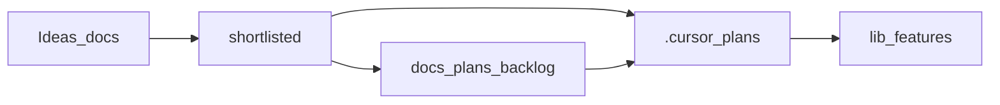

# Product ideas

Product brainstorm for **Flo Compass** and future **Event Compass** (global, multi-event). Items here are **not scheduled** until shortlisted and promoted.

Engineering-deferred work (CI, infra, sync) lives in [../backlog/](../backlog/). Ideas are attendee-facing; promotion may target backlog first or directly [`.cursor/plans/`](../../../.cursor/plans/).

**Product boundary:** Flo Compass **complements** Accelevents — no registration, ticketing, check-in, badge printing, or official agenda CRUD. See [flo-compass-product.mdc](../../../.cursor/rules/flo-compass-product.mdc).

Shipped ideas (archived): [SHIPPED.md](SHIPPED.md) — 12 promoted items removed from the active index on 2026-07-13.

## Tier definitions

| Tier | Meaning |
|------|---------|
| **now** | Flo 2026 global readiness; maps to existing modules; mock-data friendly |
| **next** | High value for ~10K attendees; modest data or schema work |
| **later** | Social, sync, or backend-heavy; post-hackathon |
| **platform** | Multi-event white-label; not Flo-specific |

## Status lifecycle

1. **idea** — captured, not reviewed
2. **shortlisted** — product owner priority for a phase
3. **promoted** — executable plan in `.cursor/plans/` (from `_TEMPLATE_parallel_plan.md`)
4. **rejected** — out of scope; keep for history

## Promotion rules

1. Product owner approves priority
2. Technical prerequisites met (see **Depends on** on each idea)
3. Respect Accelevents complement boundary
4. Create executable plan in `.cursor/plans/` or move to [../backlog/](../backlog/) if engineering-only
5. Update this index and [../README.md](../README.md)
6. Do **not** implement idea scope during an active sprint unless explicitly promoted

## Phase roadmap (not commitments)

| Phase | Focus | Typical tier |
|-------|--------|--------------|
| A | Global readiness (timezone, remote, region onboarding) | now |
| B | Scale and engagement (leaderboards, pulse, capacity) | next |
| C | Platform (event pack, white-label, multi-event) | platform |
| D | Integrations (Accelevents read-only, streams) | platform + backlog |

## Thematic files

| File | Theme | Ideas |
|------|-------|-------|
| [01-global-audience.md](01-global-audience.md) | Timezone, remote, i18n, bandwidth | 6 |
| [02-discovery-at-scale.md](02-discovery-at-scale.md) | Recommendations, plan conflicts, paths | 1 |
| [03-cross-geography.md](03-cross-geography.md) | Hubs, co-watch, QR handoff, networking card | 6 |
| [04-venue-logistics.md](04-venue-logistics.md) | Navigation, amenities, travel, safety | 4 |
| [05-engagement.md](05-engagement.md) | Leaderboards, bingo, recap, Flo Moments | 5 |
| [06-companion-ai.md](06-companion-ai.md) | Grounding, multilingual, plan-aware | 4 |
| [07-trust-privacy.md](07-trust-privacy.md) | GDPR, privacy copy, Accelevents links | 4 |
| [08-platform-multi-event.md](08-platform-multi-event.md) | Event Compass platform | 10 |

**Total: 40 active ideas** (12 shipped ideas archived in [SHIPPED.md](SHIPPED.md))

## Master index

| ID | Title | Tier | Status | File |
|----|-------|------|--------|------|
| IDEA-GA-001 | Dual timezone display | now | partial | [01-global-audience.md](01-global-audience.md) |
| IDEA-GA-002 | Remote attendee mode | now | partial | [01-global-audience.md](01-global-audience.md) |
| IDEA-GA-003 | Language-aware Companion | next | rejected | [01-global-audience.md](01-global-audience.md) |
| IDEA-GA-004 | Low-bandwidth mode | next | partial | [01-global-audience.md](01-global-audience.md) |
| IDEA-GA-005 | Region-aware onboarding | now | partial | [01-global-audience.md](01-global-audience.md) |
| IDEA-GA-006 | Quiet hours and notification respect | next | idea | [01-global-audience.md](01-global-audience.md) |
| IDEA-DS-003 | Learning paths by persona | now | partial | [02-discovery-at-scale.md](02-discovery-at-scale.md) |
| IDEA-CG-001 | Interest rooms (async) | next | shortlisted | [03-cross-geography.md](03-cross-geography.md) |
| IDEA-CG-002 | Find timezone peers | next | shortlisted | [03-cross-geography.md](03-cross-geography.md) |
| IDEA-CG-003 | Session co-watch | later | partial | [03-cross-geography.md](03-cross-geography.md) |
| IDEA-CG-004 | Office and hub map | next | shortlisted | [03-cross-geography.md](03-cross-geography.md) |
| IDEA-CG-005 | Speaker office hours queue | later | idea | [03-cross-geography.md](03-cross-geography.md) |
| IDEA-CG-006 | QR continue on mobile | now | partial | [03-cross-geography.md](03-cross-geography.md) |
| IDEA-VL-001 | Indoor navigation lite | next | shortlisted | [04-venue-logistics.md](04-venue-logistics.md) |
| IDEA-VL-003 | Crowd-aware suggestions | next | shortlisted | [04-venue-logistics.md](04-venue-logistics.md) |
| IDEA-VL-004 | Travel and visa helper | later | idea | [04-venue-logistics.md](04-venue-logistics.md) |
| IDEA-VL-005 | Emergency and safety card | later | idea | [04-venue-logistics.md](04-venue-logistics.md) |
| IDEA-EN-001 | Regional leaderboards | next | shortlisted | [05-engagement.md](05-engagement.md) |
| IDEA-EN-002 | Team and guild challenges | later | idea | [05-engagement.md](05-engagement.md) |
| IDEA-EN-003 | Session bingo v2 | next | partial | [05-engagement.md](05-engagement.md) |
| IDEA-EN-006 | Innovation vote follow-through | next | idea | [05-engagement.md](05-engagement.md) |
| IDEA-EN-007 | Flo Moments (UGC photo gallery) | next | shortlisted | [05-engagement.md](05-engagement.md) |
| IDEA-CA-001 | Grounded answers only | next | partial | [06-companion-ai.md](06-companion-ai.md) |
| IDEA-CA-002 | Multilingual prompts | next | rejected | [06-companion-ai.md](06-companion-ai.md) |
| IDEA-CA-004 | Role-based tone | later | idea | [06-companion-ai.md](06-companion-ai.md) |
| IDEA-CA-005 | Accessibility Q&A | later | partial | [06-companion-ai.md](06-companion-ai.md) |
| IDEA-TP-001 | Privacy-first profile | later | partial | [07-trust-privacy.md](07-trust-privacy.md) |
| IDEA-TP-002 | GDPR-style controls | later | partial | [07-trust-privacy.md](07-trust-privacy.md) |
| IDEA-TP-003 | No real PII in mock data | later | partial | [07-trust-privacy.md](07-trust-privacy.md) |
| IDEA-TP-004 | Accelevents deep-link boundary | now | partial | [07-trust-privacy.md](07-trust-privacy.md) |
| IDEA-PE-001 | Event picker (multi-event home) | platform | idea | [08-platform-multi-event.md](08-platform-multi-event.md) |
| IDEA-PE-002 | White-label theming | platform | idea | [08-platform-multi-event.md](08-platform-multi-event.md) |
| IDEA-PE-003 | Universal profile, per-event plans | platform | idea | [08-platform-multi-event.md](08-platform-multi-event.md) |
| IDEA-PE-004 | Timezone engine (IANA) | platform | partial | [08-platform-multi-event.md](08-platform-multi-event.md) |
| IDEA-PE-005 | Integration adapters (read-only) | platform | idea | [08-platform-multi-event.md](08-platform-multi-event.md) |
| IDEA-PE-006 | Offline-first event pack | platform | partial | [08-platform-multi-event.md](08-platform-multi-event.md) |
| IDEA-PE-007 | Event pack schema | platform | partial | [08-platform-multi-event.md](08-platform-multi-event.md) |
| IDEA-PE-008 | Config per event | platform | partial | [08-platform-multi-event.md](08-platform-multi-event.md) |
| IDEA-PE-009 | i18n and RTL platform-wide | platform | partial | [08-platform-multi-event.md](08-platform-multi-event.md) |
| IDEA-PE-010 | Event type templates | platform | idea | [08-platform-multi-event.md](08-platform-multi-event.md) |

### Tier counts

| Tier | Count |
|------|-------|
| now | 6 |
| next | 14 |
| later | 10 |
| platform | 10 |

## Shortlist for Sprint 2 (product)

| ID | Theme | Why Sprint 2 |
|----|-------|--------------|
| EN-001 | Engagement | Fair regional competition at ~10K scale |
| EN-007 | Engagement | Community UGC highlights beyond personal recap |
| VL-003 | Venue | Occupancy-aware alternate-space routing |
| CG-004 | Geography | Global hub offices on campus map |
| CG-002 | Geography | Connect attendees in same timezone band |
| CG-001 | Geography | Async interest rooms for cross-region sync |
| VL-001 | Venue | Finish step-by-step indoor path overlay |

## Overlap with engineering backlog

| Idea area | Backlog item |
|-----------|--------------|
| Cross-device plan sync | [cross-device-sync.md](../backlog/cross-device-sync.md) |
| Live announcements | [live-announcements-feed.md](../backlog/live-announcements-feed.md) |
| Remote API / stream data | [full-remote-sync.md](../backlog/full-remote-sync.md) |
| Analytics / audit | [audit-trail-analytics.md](../backlog/audit-trail-analytics.md) |
| Encrypted local storage | [encrypted-web-storage.md](../backlog/encrypted-web-storage.md) |
| API contracts | [api-contract-openapi.md](../backlog/api-contract-openapi.md) |
| Design tokens | [design-tokens-storybook.md](../backlog/design-tokens-storybook.md) |
| Flo Moments UGC gallery | [flo-moments-ugc-gallery.md](../backlog/flo-moments-ugc-gallery.md) |

## Adding a new idea

Copy [_TEMPLATE.md](_TEMPLATE.md), assign the next ID in the correct prefix (`GA`, `DS`, `CG`, `VL`, `EN`, `CA`, `TP`, `PE`), add a row to the master index above.
