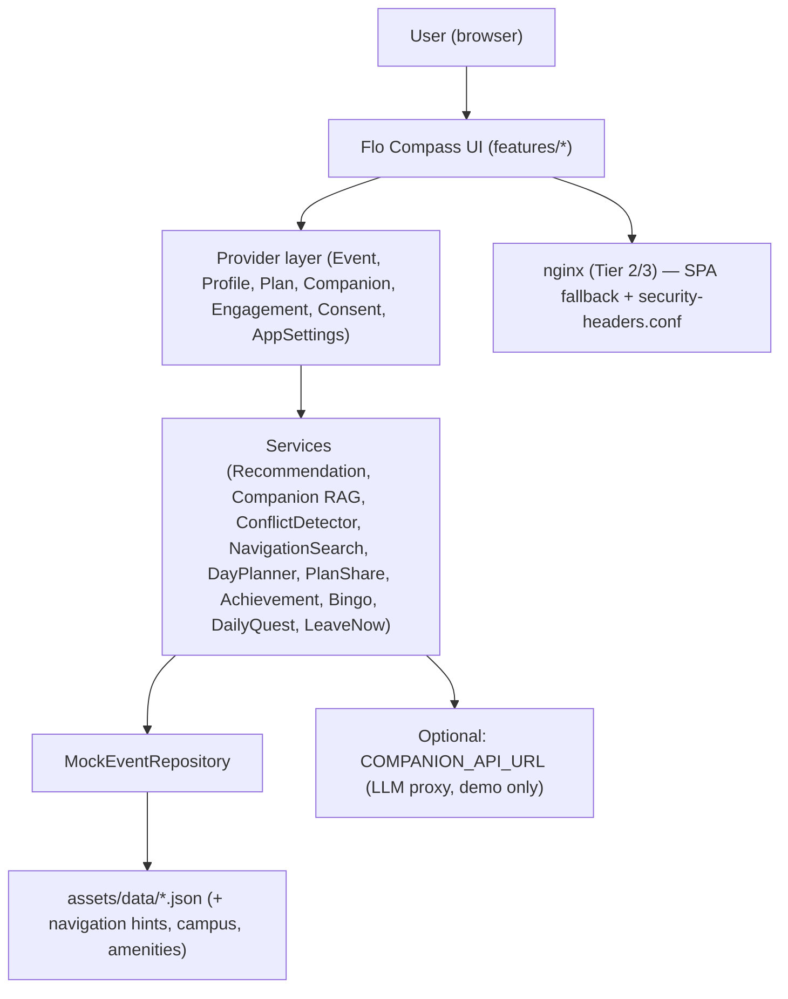

# The Waters of Innovation  
## Episode 2: The Rapids  
### Cursor Hackathon Team README

## Team

**Team name:** `ai-avengers`

**Repository:** https://ourcode.nagarro.com/gbu-corp/ai-dominance-hackathons/the-rapids-hackathon/teams/ai-avengers

| Name | Role | Hackathon focus |
|---|---|---|
| Kamlesh Kumar | Lead Developer / Cursor Driver | End-to-end app build via Cursor |
| Ashish | Data & Content QA | Gurgaon Office dataset, a11y review, demo sessions |
| Kishan | Ship & Story | Deploy parity, README, augmentation log, video, demo backup |

---

## For judges

**Live app:** https://ai-avengers.whitepond-5b7dc6a5.eastus.azurecontainerapps.io/ (Azure Container Apps; deploy pipeline output).

Deep-link smoke test in the browser (refresh-safe):
- Session detail: https://ai-avengers.whitepond-5b7dc6a5.eastus.azurecontainerapps.io/session/s-001
- Venue map with highlight: https://ai-avengers.whitepond-5b7dc6a5.eastus.azurecontainerapps.io/map?room=ven-N801
- Health probe: https://ai-avengers.whitepond-5b7dc6a5.eastus.azurecontainerapps.io/health (returns `{"status":"ok"}`)

Quick 5-step reviewer path:

1. Watch `hackathon-docs/video.mp4` (target ≤120s; sidecar captions in `video.srt`).
2. Read Sections 1–4 of this README (concept, demo, run, architecture).
3. Skim [hackathon-docs/cursor-rules/README.md](cursor-rules/README.md) for the 22-rule catalog.
4. Open [hackathon-docs/augmentation-log.md](augmentation-log.md) for per-run Cursor evidence (113 entries; hallucination-tagged).
5. Local run: `deploy-local.cmd` (Tier 2) + open `http://localhost:8080/session/s-001` (deep-link refresh) — or just visit the Live app URL above.

**Submission commit:** `ff43223fe6e67d4ff2a2fec09fd955a2fe351d7a` (`ff43223` — `Submit`). Tag with `git tag demo-submission ff43223fe6e67d4ff2a2fec09fd955a2fe351d7a && git push origin demo-submission` before MR to `main`.

---

## AI-first workflow

- **Rules-first:** Twenty-two `.cursor/rules/*.mdc` files ground every prompt in product boundaries, data standards, WSL2 dev, CI guardrails, dev-loop tiers, parallel-agent discipline, parallel worktrees, git hygiene, plan auto-continue, ship-branch pipeline, AI verification checklist, rules catalog maintenance, and deliverable specs.
- **Plan mode:** Architecture and multi-phase slices are designed in plan mode before implementation to reduce rework.
- **Solo-driver + squad:** Kamlesh drives Cursor end-to-end; Ashish owns dataset/a11y QA; Kishan owns deploy validation and deliverables.
- **Batched augmentation log:** One entry per completed plan run (not per phase) after WSL Tier 1/2 validation and agents idle.
- **Responsible AI safeguards:** Rule-based companion fallback (no silent LLM failure), fictional speakers only (no PII), privacy consent gate, and mandatory WSL validation after code edits.
  - **Prompt-injection guard** — [`LlmCompanionService._looksLikeInjection`](lib/data/services/llm_companion_service.dart) rejects jailbreak phrases before any API call.
  - **PII response filter** — [`LlmCompanionService._containsPii`](lib/data/services/llm_companion_service.dart) drops LLM answers that match email/phone/card patterns.
  - **Deterministic fallback** — [`RuleBasedCompanionService`](lib/data/services/rule_based_companion_service.dart) answers every query when the LLM is disabled, rate-limited, or returns invalid output (never silent failure).

---

## 1. Concept

**App name:** Flo Compass

**One-sentence pitch:**  
Flo Compass helps Flo 2026 attendees cut through 651 parallel sessions at Nagarro Gurgaon Office with explainable recommendations, a local shortlist, and an AI companion — complementing Accelevents, not replacing it.

**Target users:**  
Attendees overwhelmed by session choice at the 3-day summit across ~90 spaces (Ground + floors 6–13).

**Problem solved:**  
Discovery and prioritization at scale — interests captured once, ranked sessions with clear “why,” natural-language Q&A over speakers/topics/venues/campus logistics, and a personal plan with conflict warnings.

**Why this is not a clone or another app:**  
We explicitly do **not** build registration, ticketing, check-in, badge printing, or official agenda CRUD (Accelevents owns those). Flo Compass adds discovery, explainability, campus navigation, engagement, and companion Q&A around the official platform.

---

## 2. Demo

**Live app:** https://ai-avengers.whitepond-5b7dc6a5.eastus.azurecontainerapps.io/ — open in a browser to skip the local build.

**Demo scenario:**  
Ask Flo first — the on-site friend that combines **what** (sessions), **where** (~90 venues + amenities), **when** (event clock + My Plan), and **what to do next** (directions, map, conflict fix). Flo Compass complements Accelevents (official agenda listing); we do not replace registration or ticketing.

**Demo steps (Ask Flo first — extended path):**

1. Run with `--dart-define=EVENT_NOW=2026-11-04T10:05:00` and `--dart-define=CONFIG_PROFILE=dev` for live demo timing and full feature flags
2. Accept **privacy consent** on first visit (visitor deep links to `/session/:id` skip onboarding but still respect consent)
3. Open app → onboard as **Engineer** with interests **GenAI**, **Cursor**, **Leadership**
4. **Discover** — Happening Now / Starting Soon; filter by day, floor, track; open `/session/s-001` or `/speaker/spk-001`
5. **Ask Flo** — proactive event-day card shows next session + countdown → tap **Get directions** (`/directions?session=…`)
6. Ask **“Where can I park my car?”** → mock parking availability by floor (B–4)
7. Ask **“Nearest ladies restroom Floor 8”** → North wing restrooms with map action (`/map?room=…`)
8. Ask **“I have 20 minutes”** → Floor 5 garden break when nothing is planned soon
9. Bookmark conflicting sessions in **My Plan**, then ask **“Fix my 11am clash”** → conflict coach suggests skip/keep
10. **Campus map** — open `/map` or highlight a room from companion action chips
11. **Connect** — create a networking card at `/connect/edit`, share via `/connect/share`, open public card at `/connect/:token`
12. **Engagement** — **Profile** recap, XP/achievements; optional `/leaderboard`, `/bingo`, `/recap` (feature-flagged per config profile)
13. **Learning path** — open `/learning-path/path-genai` from Discover or companion chips
14. **Theme** — Profile → **System** theme (default), high contrast, or OpenDyslexic font toggle
15. State explicitly: *Accelevents lists the official agenda; Ask Flo helps you navigate and decide on-site.*

**Legacy demo path (still valid):** Plan my Day 1 → CEO Fireside location → My Plan share link `/plan/import?d=...` → QR at `/qr`

**Demo data / credentials:**  
All speakers and attendees are **fictional** mock data. No real PII. Optional LLM: `--dart-define=COMPANION_API_URL=https://your-demo-proxy.example/chat` (demo only; rule-based fallback always works). Auth is disabled in default config (`auth.enabled: false`).

**Dev mock users** (`CONFIG_PROFILE=dev`, Profile → Demo access after onboarding):

| id | name | email | role |
|---|---|---|---|
| kamlesh | Kamlesh Kumar | kamlesh.kumar@demo.flo-compass.example | admin |
| kishan | Kishan | kishan@demo.flo-compass.example | organizer |
| ashish | Ashish | ashish@demo.flo-compass.example | attendee |

Sign-in is optional unless `auth.enabled` is `true`. Mock users are **not** included in `config.prod.json`.

---

## 3. Run the App

**Prerequisites (WSL2 — local dev & local deploy testing only):**

- Ubuntu 24.04 on WSL2
- Flutter latest stable and Dart 3.10+ **inside WSL**
- Docker and Docker Compose **inside WSL** (not Docker Desktop on Windows)
- Git inside WSL

```bash
flutter --version
docker --version
docker compose version
```

**Install:**

```bash
flutter pub get
```

**Run locally (inside WSL — Tier 1):**

```bash
bash scripts/wsl_dev.sh
# Open http://localhost:3000 from Windows browser

# Windows launcher (same Tier 1 loop):
# dev-local.cmd   or   dev-local.ps1

# Backward-compat alias:
# bash scripts/dev_wsl.sh

# Optional LLM companion (demo only):
flutter run -d web-server --web-port=3000 --web-hostname=0.0.0.0 \
  --dart-define=COMPANION_API_URL=https://your-proxy.example/chat
# Recommended live demo clock:
flutter run -d web-server --web-port=3000 --web-hostname=0.0.0.0 \
  --dart-define=EVENT_NOW=2026-11-04T10:05:00

# Runtime config profile (feature flags in assets/config/):
flutter run -d web-server --web-port=3000 --web-hostname=0.0.0.0 \
  --dart-define=CONFIG_PROFILE=dev
# Profiles: `default` | `dev` | `prod` — loads assets/config/config.<profile>.json
# Flags: leaderboard, bingo, recap, companionLlm, lowBandwidthDefault, analytics, analyticsRemote
# Optional analytics batch endpoint (demo only):
flutter run -d web-server --web-port=3000 --web-hostname=0.0.0.0 \
  --dart-define=ANALYTICS_API_URL=https://your-proxy.example/analytics
# Leaderboard route redirects to /discover when leaderboard=false (prod profile)

# Optional remote event API (falls back to mock when unreachable):
flutter run -d web-server --web-port=3000 --web-hostname=0.0.0.0 \
  --dart-define=API_BASE_URL=https://your-api.example
# Optional feedback capture endpoint (offline queue used when empty):
flutter run -d web-server --web-port=3000 --web-hostname=0.0.0.0 \
  --dart-define=FEEDBACK_API_URL=https://your-proxy.example/feedback
# Dev-profile-only platform-role override (organizer|admin|attendee):
flutter run -d web-server --web-port=3000 --web-hostname=0.0.0.0 \
  --dart-define=CONFIG_PROFILE=dev --dart-define=MOCK_PLATFORM_ROLE=admin
```

**Full `--dart-define` matrix:**

| Var | Effect | Where read |
|---|---|---|
| `CONFIG_PROFILE` | Loads `assets/config/config.<profile>.json` (`default` / `dev` / `prod`) | [`AppConfig.configProfile`](lib/core/config/app_config.dart) |
| `EVENT_NOW` | Fixed ISO-8601 clock for demos | [`AppConfig.eventNow`](lib/core/config/app_config.dart) |
| `COMPANION_API_URL` | LLM proxy endpoint (demo only) | [`AppConfig.companionApiUrl`](lib/core/config/app_config.dart) |
| `API_BASE_URL` | Remote event API base (mock fallback on failure) | [`AppConfig.apiBaseUrl`](lib/core/config/app_config.dart), [`RuntimeConfig`](lib/core/config/runtime_config.dart) |
| `FEEDBACK_API_URL` | Feedback POST endpoint (offline queue when empty) | [`AppConfig.feedbackApiUrl`](lib/core/config/app_config.dart), [`FeedbackService`](lib/data/services/feedback_service.dart) |
| `ANALYTICS_API_URL` | Analytics batch POST endpoint | [`AppConfig.analyticsApiUrl`](lib/core/config/app_config.dart) |
| `MOCK_PLATFORM_ROLE` | Dev-profile role override (`organizer` / `admin` / `attendee`) | [`RuntimeConfig.resolvePlatformRoleOverride`](lib/core/config/runtime_config.dart) |

**Test:**

```bash
flutter analyze
dart format --set-exit-if-changed .
flutter test
flutter test --coverage
bash scripts/wsl_coverage.sh   # enforces services ≥60%, utils ≥60%, lib ≥45%
```

**Build & local deploy test (WSL Tier 2 — pre-push):**

```bash
bash scripts/wsl_deploy.sh
# Or Windows: deploy-local.cmd / deploy-local.ps1
# Verify http://localhost:8080/ AND http://localhost:8080/session/s-001 (refresh)
# Also smoke: /directions?session=s-001, /plan/import, /map, /connect/edit, /health
```

**Ship for review (Tier 1 + Tier 2 smoke + push + MR):**

```bash
ship-branch.cmd          # Windows → WSL
# Or: bash scripts/wsl_ship_branch.sh
```

**Production deployment (unchanged):**  
Push to default branch → GitLab CI builds Docker image → `docker/arm-template.json` deploys to Azure Container Apps. Confirm pipeline log: `Deployed to https://{fqdn}`. Current live FQDN: **https://ai-avengers.whitepond-5b7dc6a5.eastus.azurecontainerapps.io/** — deep-link test: `/session/s-001`, `/map?room=ven-N801`, `/health`. The FQDN is emitted by `az deployment group create` in `.gitlab-ci.yml` and is stable across deploys as long as the container app and managed environment names do not change.

**Web notes (`shared_preferences`):**  
On web, preferences use `localStorage` (~5MB soft cap), are not synced across devices, and clear in incognito. Fine for a local session shortlist.

**Regenerate mock data:**

```bash
dart run tools/generate_flo_data.dart   # or: node tools/generate_flo_data.js
dart run tools/validate_dataset.dart   # or: node tools/validate_dataset.js
```

---

## 4. Architecture

**Short architecture summary:**  
Flutter web UI with `provider` state, `go_router` navigation (shell tabs + overlay routes), JSON assets for 651 sessions across Gurgaon topology with wing-aware venues, client-side companion RAG (`CompanionKnowledgeRetriever`), deterministic recommendation scoring, EventClockService demo time control, engagement gamification (XP, achievements, bingo, leaderboard, recap), Connect networking cards, campus logistics (map, directions, amenities), plan sharing, privacy consent gate, system-theme default with high-contrast and dyslexia options, and rule-based companion (optional LLM via dart-define). nginx serves the SPA with security headers (CSP, HSTS, COOP, CORP) and `try_files` deep-link fallback.



| Component | Purpose |
| ------------- | ---------------- |
| `MockEventRepository` | Loads and validates Flo 2026 JSON assets (~651 sessions) |
| `RecommendationService` | Weighted scoring + focused/balanced/adventurous modes |
| `CompanionKnowledgeRetriever` | Client-side RAG over sessions, venues, amenities, hints |
| `EventClockService` | Mock/live event clock (`EVENT_NOW` + in-app override) |
| `EngagementState` + `AchievementService` | XP, levels, achievements, attendance, ratings |
| `BingoService` / `DailyQuestService` | Event-day gamification overlays |
| `DayPlannerService` | Companion "Plan my day" no-conflict schedule |
| `PlanShareService` | Encode/decode plan URLs for `/plan/import` |
| `NetworkingCardShareService` | vCard connect cards at `/connect/:token` |
| `NavigationSearchService` | Campus amenity and logistics queries |
| `RuleBasedCompanionService` | Deterministic Q&A + nav intents + conflict coach |
| `LlmCompanionService` | Optional API path with injection guard + fallback |
| `ConflictDetector` | Overlap detection in My Plan |
| `RuntimeConfig` | `CONFIG_PROFILE` feature flags from `assets/config/` |
| `go_router` + nginx SPA fallback | Deep links survive Azure refresh |

**Key routes (verified against `lib/core/routing/app_routes.dart` on 2026-07-13):**

Non-attendee routes are gated by `AppCapability` in the router redirect.

| Route | Purpose |
|-------|---------|
| `/discover` | Ranked session list, filters, Now/Next bar |
| `/companion` | Ask Flo (`?q=` prefill) |
| `/my-plan` | Bookmarked sessions + conflicts |
| `/profile` | Settings, theme, engagement recap |
| `/onboarding` | Role + interests capture |
| `/session/:id` | Session detail (public deep link) |
| `/speaker/:id` | Speaker detail (public deep link) |
| `/map` | Venue map (`?room=` highlight) |
| `/directions` | Walking directions (`?session=` required) |
| `/learning-path/:id` | Curated learning path detail |
| `/plan/import` | Import shared plan (`?d=` payload) |
| `/connect/edit`, `/connect/share`, `/connect/:token` | Networking cards |
| `/leaderboard`, `/bingo`, `/recap`, `/qr` | Engagement overlays (flagged) |
| `/consent`, `/privacy`, `/accessibility` | Legal / a11y statements |
| `/auth/callback` | Azure AD PKCE OAuth2 callback — full token exchange + refresh; disabled by config (`auth.enabled: false`) |
| `/organizer` | Organizer operations dashboard (RBAC: `moderateQa`) |
| `/organizer/announcements`, `.../compose`, `.../:id` | Announcement compose/detail (RBAC: `publishAnnouncement`) |
| `/organizer/prompts` | Companion prompt curation |
| `/organizer/qa` | Companion Q&A moderation |
| `/admin` | Admin operations (RBAC: `manageOpsConfig`) |

**Key decisions:**

1. **Mock-first** — ship demo without backend; thin `lib/data/` layer for future API
2. **Rule-based AI fallback** — companion never fails silently; banner when LLM unavailable
3. **Provider + go_router** — simple state for hackathon velocity; system theme default
4. **Config profiles** — `default` / `dev` / `prod` JSON toggles leaderboard, LLM, low-bandwidth defaults

**Assumptions / limitations:**

1. No Accelevents API integration in MVP
2. LLM API keys must not ship in web bundle — proxy or dart-define only for demos
3. 651 sessions loaded client-side; split-by-day if bundle grows
4. Azure AD auth is fully implemented ([`AuthService`](lib/core/auth/auth_service.dart): PKCE, refresh, JWT claims, role allowlists, mock sign-in) but `auth.enabled: false` in all shipped config profiles — flip the flag + fill `tenantId` / `clientId` / `redirectUri` in `assets/config/config.*.json` to enable, no code change required
5. Post-hackathon roadmap is captured in `docs/plans/Ideas/` (52 product ideas) and `docs/plans/backlog/` (23 engineering items); active plans live in `.cursor/plans/`.

---

## 4b. Feature matrix

| ROI | Area | Shipped | Route / entry | Notes |
|-----|------|---------|---------------|-------|
| * | Session discovery | Yes | `/discover` | Explainable recs, filters, Happening Now |
| * | Session / speaker detail | Yes | `/session/:id`, `/speaker/:id` | Public deep links |
| * | Ask Flo companion | Yes | `/companion` | RAG + rule engine; optional LLM |
| * | My Plan + conflicts | Yes | `/my-plan` | `shared_preferences`; conflict coach |
| | Plan share / import | Yes | `/plan/import?d=` | URL-encoded shortlist |
| * | Campus map | Yes | `/map?room=` | ~90 venues, wing-aware |
| * | Walking directions | Yes | `/directions?session=` | Leave-now scheduler on event day |
| | Campus logistics Q&A | Yes | Ask Flo | Parking, restrooms, amenities, breaks |
| | Learning paths | Yes | `/learning-path/:id` | Curated multi-session tracks |
| | Connect cards | Yes | `/connect/edit`, `/connect/share`, `/connect/:token` | vCard networking |
| | Engagement (XP, badges) | Yes | Profile | Achievements, attendance, ratings |
| | Bingo | Yes (flagged) | `/bingo` | `bingo: true` in all profiles |
| | Leaderboard | Yes (flagged) | `/leaderboard` | Off in prod profile → redirects |
| | Event recap | Yes (flagged) | `/recap` | End-of-day summary |
| | QR generator | Yes | `/qr` | Share links on-site |
| | Privacy consent | Yes | `/consent` | Gates app until accepted |
| | Theme / a11y | Yes | Profile | System default, high contrast, dyslexia font |
| | Offline banner | Yes | Shell | Amber banner when `navigator.onLine` false |
| | PWA install hint | Yes | Shell | Coordinator on supported browsers |
| | Security headers | Yes | nginx | CSP, HSTS, X-Frame-Options, COOP, CORP |
| | Azure AD auth | Yes (disabled by config) | `/auth/callback` | Full PKCE + refresh + JWT role resolution; flip `auth.enabled` to enable |
| | Organizer operations | Yes | `/organizer/*` | Announcements, prompts, Q&A moderation (RBAC) |
| | Admin operations | Yes | `/admin` | Ops config (RBAC: `manageOpsConfig`) |
| | Live announcements banner | Yes | Shell | Published announcements on Discover |
| | Session Q&A tab | Yes | `/session/:id?focus=qa` | Pre-session questions queue |
| | Analytics service | Yes (flagged) | config `analytics` | Consent-aware, PII-filtered batching |
| | Guided contextual tour | Yes | Profile menu | `kTourVersion: 2`; auto-runs once after onboarding |
| | Platform-roles RBAC | Yes | config | `platformRoles.organizerAllowlist` / `adminAllowlist` |
| | Command palette + shortcuts | Yes | `Ctrl/Cmd+K`, `Ctrl+/`, `1-4`, `Esc` | Search sessions/speakers/venues/tracks; recent history |
| | Voice input (Ask Flo) | Yes | `/companion` mic button | `webkitSpeechRecognition`; graceful fallback when unsupported |
| | Web push notifications | Yes (opt-in) | Profile → Leave-now push | Native `Notification` API + service worker; permission-aware |
| | iCal / ICS export | Yes | Session detail → Add to calendar | Single session or full plan `.ics` |
| | Agenda change alerts | Yes | Notifications sheet | Detects venue/time/day changes on planned + followed sessions |
| | Followed speakers | Yes | Speaker detail | Powers agenda alerts and companion prompts |
| | i18n (de / en / es) | Yes | System locale | `AppLocalizations` (`flutter_localizations`); locale override in Profile |
| | Runtime allowlist editor | Yes | `/admin` | Live organizer/admin allowlist edits (persisted, audited) |
| | Structured audit log | Yes | `/organizer` audit tab | Q&A, plan, consent, announcement, ops actions with actor/timestamp |
| | Behavior-signal ranker | Yes | Discover recs | Track/tag/bookmark/positive signals feed the recommendation weights |
| | Remote-repo swap-in | Yes (mock fallback) | `--dart-define=API_BASE_URL=…` | DTO/mapper layer + graceful mock fallback when API is down |
| | Error boundary + crash reporter | Yes | App shell | `runZonedGuarded` + `FlutterError.onError` → friendly UI + `app_error` analytics |
| | Feedback capture | Yes | Error screens; Profile → Report | Posts to `FEEDBACK_API_URL` with offline queue |

`*` = one of the 8 highest-ROI tour features (see Section 4c).

---

## 4c. Highest-ROI features

These eight features are the canonical judged-value slice for Flo Compass — curated by the team and shipped as the guided product tour (`kTourVersion: 2` in [lib/shared/tour/tour_controller.dart](lib/shared/tour/tour_controller.dart) lines 58–116). Every step is instrumented, covered by tour tests, and rendered in the ~120s demo video (`hackathon-docs/video.mp4`). Provenance: augmentation-log entry `## [2026-07-13] Tour guide expansion to 8 highest-ROI steps` in [hackathon-docs/augmentation-log.md](hackathon-docs/augmentation-log.md). Replay from Profile menu or Advanced settings; auto-runs once after onboarding.

| # | Step | Route | ROI rationale | Key files |
|---|------|-------|---------------|-----------|
| 1 | Now / Next bar | `/discover` | Real-time "Happening Now / Starting Soon" anchored to `EVENT_NOW` | [lib/shared/widgets/now_next_bar.dart](lib/shared/widgets/now_next_bar.dart) |
| 2 | Discover search + filters | `/discover` | Filter 651 sessions by day, floor, track without losing context | [lib/features/discover/discover_screen.dart](lib/features/discover/discover_screen.dart) |
| 3 | Recommendation reason | `/session/s-001` | Explainable rank — no black-box sorting | [lib/data/services/recommendation_service.dart](lib/data/services/recommendation_service.dart), [lib/shared/widgets/session_card/session_card.dart](lib/shared/widgets/session_card/session_card.dart) |
| 4 | Add to My Plan | `/session/s-001` | One-tap shortlist; tour auto-advances on tap | [lib/providers/plan_provider.dart](lib/providers/plan_provider.dart), session detail sticky actions |
| 5 | Logistics tab | `/session/s-001` (Logistics) | Room, floor, wing, and amenities in one card | [lib/features/session_detail/widgets/session_detail_logistics_tab.dart](lib/features/session_detail/widgets/session_detail_logistics_tab.dart) |
| 6 | Venue map button | `/session/s-001` → `/map` | Wing-aware campus map with the target room highlighted | [lib/features/venue_map/venue_map_screen.dart](lib/features/venue_map/venue_map_screen.dart) |
| 7 | Ask Flo companion | `/companion` (prefills "Where can I park my car?") | Rule-based Q&A that never fails the demo | [lib/data/services/rule_based_companion_service.dart](lib/data/services/rule_based_companion_service.dart), [lib/features/companion/companion_screen.dart](lib/features/companion/companion_screen.dart) |
| 8 | My Plan summary | `/my-plan` | Bookmarks + conflict warnings + notes | [lib/features/my_plan/my_plan_screen.dart](lib/features/my_plan/my_plan_screen.dart), [lib/data/services/conflict_detector.dart](lib/data/services/conflict_detector.dart) |

---

## 5. Cursor Usage

> **Fact box (verified 2026-07-13):** 22 Cursor rules · 651 mock sessions · 23 engineering backlog items · **113 augmentation-log entries** · **458 automated tests across 131 files** (services 70.70% / utils 81.82% / lib 60.62% line coverage).

**How we prepared Cursor during the 7-day setup phase:**  
The project uses **22 rules** (see catalog below) — `.cursor/rules/*.mdc` files that ground the AI in product boundaries, Gurgaon data standards, Flutter web conventions, WSL2-only dev, WCAG AA guardrails, CI/CD guardrails, team workflow, dev-loop tiers, parallel-agent ownership, parallel worktrees, plan auto-continue, ship-branch pipeline, git hygiene, nginx SPA routing, security, AI verification checklist, planned-later backlog capture, rules catalog maintenance, and hackathon deliverables.

**Canonical catalog:** [hackathon-docs/cursor-rules/README.md](cursor-rules/README.md) — categorized index, per-rule summaries, and `@cite` guidance.

**Cursor rules / setup files (22 total):**

| File / Rule | Purpose |
| --------------------- | ----------- |
| `.cursor/rules/hackathon-context.mdc` | Always-on project context, balanced shipping style |
| `.cursor/rules/flo-compass-product.mdc` | Product boundaries, MVP order, Accelevents complement |
| `.cursor/rules/flo-compass-data.mdc` | 651 sessions, Gurgaon venue topology, wing and cafeteria integrity rules |
| `.cursor/rules/flutter-dart.mdc` | Flutter web conventions, theme palette, web-first |
| `.cursor/rules/hackathon-docs.mdc` | Mandatory deliverable filenames and README standards |
| `.cursor/rules/ai-augmentation.mdc` | One batched augmentation entry after full plan run + validation + agents idle |
| `.cursor/rules/ai-verification.mdc` | Pre-accept checks + hallucination category tags for augmentation log |
| `.cursor/rules/cursor-rules-catalog.mdc` | Meta-rule — keep catalog parity when adding or changing rules |
| `.cursor/rules/wsl2-development.mdc` | WSL2 local dev + local deployment testing (Tier 1 and Tier 2) |
| `.cursor/rules/local-wsl-auto-validation.mdc` | Always-on WSL Tier 1/2 runs + Tier 1/2/3 reference appendix; plan-gap logging |
| `.cursor/rules/dev-loops.mdc` | Fast / feature / pre-push / ship / CI tiers with time budgets and scripts |
| `.cursor/rules/deployment-cicd.mdc` | Docker/CI guardrails — Flutter 3.44.0, GitLab variable names |
| `.cursor/rules/web-nginx-config.mdc` | nginx SPA fallback, CSP, cache headers |
| `.cursor/rules/ship-branch.mdc` | Ship-branch pipeline before MR — Tier 1 + Tier 2 smoke + push + GitLab MR |
| `.cursor/rules/team-workflow.mdc` | Solo-driver + squad model, augmentation triggers |
| `.cursor/rules/parallel-agents.mdc` | File-level ownership contract + merge discipline for parallel subagents |
| `.cursor/rules/parallel-plans-workflow.mdc` | Worktree slots, port table, lifecycle scripts, three-layer branch model |
| `.cursor/rules/plan-auto-continue.mdc` | Checkpoint + auto-continue for long-running plan runs (interrupt-safe handoff) |
| `.cursor/rules/accessibility.mdc` | WCAG AA checks for keyboard, semantics, contrast, skip links |
| `.cursor/rules/security-secrets.mdc` | No secrets/PII; `--dart-define` for local API config |
| `.cursor/rules/git-hygiene.mdc` | Branch-per-plan, Conventional Commits, working-tree hygiene |
| `.cursor/rules/planned-later-capture.mdc` | Capture deferred work in `docs/plans/backlog` instead of on active branch |

**How we used Cursor:**  
Plan mode for architecture; feature slices (Discover, Companion, Connect, engagement); `@` rule references in prompts; subagents for exploration; tests co-generated with services; parallel worktrees for isolated plan branches.

**Best Cursor-assisted moment:**  
Implementing the Ask Flo intelligence layer end-to-end (RAG retriever, rule-based nav intents, proactive event-day card, and conflict coach) in one deterministic slice.

**Where we corrected Cursor:**  
Phase 0 foundation mismatch: `Session.day` and `EventMeta` model assumptions did not match dataset reality; corrected models/tests/services before feature work. README script names updated from legacy `dev_wsl.sh` to `wsl_dev.sh` + Windows launchers. Session-count drift caught in review (768 → 640 → 651) and aligned across dataset, rules, and README. SRT/video duration mismatch flagged during README review — captions regenerated via Whisper and later time-scaled with the 1.1× video speedup. Duplicate `DOCKER_PORT` collisions during parallel worktree rollout fixed via `.worktree.env` port slots. Hallucination category tags (`api-hallucination`, `wrong-version`, `wrong-path`, `stale-docs`, `scope-drift`, `dataset-drift`, `security-miss`) now mandatory in every augmentation-log entry per `ai-verification.mdc`. README audit on 2026-07-13 caught Azure AD auth misclassified as "scaffold only" (actually full PKCE + refresh in [`AuthService`](lib/core/auth/auth_service.dart)) and surfaced a dozen shipped-but-undocumented features (command palette, voice input, web push, iCal export, agenda change alerts, i18n, audit log, error boundary, remote-repo swap-in, runtime allowlist editor); all corrected in Sections 3 and 4b, plus the live Azure Container Apps URL is now inlined instead of the `{fqdn}` placeholder (`stale-docs` category).

---

## 6. Speed

**What helped us move fast:**

1. Vertical slices per MVP step (data → onboarding → discover → detail → plan → companion) plus v6 impact sprint phases
2. Cursor rules catalog (22 rules; see Section 5) prevented CI/nginx rework
3. Seeded data generator produced 651 sessions + featured demos; optional avatar assets stayed small and local
4. Tiered dev loops (`wsl_dev.sh` for UI, `wsl_deploy.sh` only pre-push) kept inner loop under 90s

**What slowed us down:**

1. Flutter/Dart CLI availability can vary by environment; keep generator + validator scripts deterministic and mock-first
2. CanvasKit cold-start on first web load
3. Parallel plan worktrees require port-slot discipline (`.worktree.env`)

**What we would improve next time:**

1. Add optional `quality` CI stage earlier
2. Split sessions JSON by day or lazy-load map assets if bundle exceeds budget

**Offline behavior:** After a successful first load, Flo Compass shows an amber offline banner when `navigator.onLine` is false; Discover and My Plan continue from in-memory mock data and `shared_preferences`. Flutter 3.44’s default service worker is a deprecation stub (no asset precache list) — offline resilience depends on browser HTTP cache after first visit. Cold start without network, LLM Companion, and voice input may be unavailable offline.

---

## 6b. Known issues and caveats

- Web `shared_preferences` maps to `localStorage` (~5 MB soft cap); data clears in incognito and does not sync across devices.
- CanvasKit cold-start latency on first web load can delay the first paint.
- Azure AD auth is fully implemented (PKCE + refresh + JWT role resolution in [`AuthService`](lib/core/auth/auth_service.dart)) but `auth.enabled: false` in all shipped config profiles.
- Demo video is voice-recorded by the team, enhanced via ffmpeg (denoise, EQ, compression, loudnorm), and time-scaled 1.1× to fit the 2-minute hackathon cap.
- Contextual help tour (`kTourVersion: 2`) auto-runs once after onboarding; replay from Profile menu.

---

## 7. Quality

**Tested flows:**

1. Privacy consent → onboarding → profile persisted → Discover ranked list
2. Discover filters (day/floor/track) + session detail deep link `/session/s-001`
3. Ask Flo demo queries (parking, restrooms, 20-minute break, conflict coach, CEO keynote)
4. My Plan bookmark + conflict warning + `/plan/import` round-trip
5. Campus map `/map?room=…` and directions `/directions?session=s-001`
6. Connect card create → share → public `/connect/:token`
7. Engagement: profile achievements, `/bingo`, `/leaderboard`, `/recap`
8. Theme: system default, high contrast, text scale (a11y tests)
9. Docker Tier 2: root + deep-link refresh + `/health` JSON

**Automated tests (verified 2026-07-13, live WSL Tier 1):**
**458 test cases across 131 files** in `test/` (`flutter test` in WSL) — unit tests for services (recommendation, companion RAG, conflict, navigation, engagement, walking-time, vertical-movement, audit log, agenda-change detector), routing/visitor-gate/platform-role gate tests, provider tests, widget smoke tests, golden tests (session card, achievement badge), a11y suites (theme contrast, motion policy, text scale, high contrast, l10n arb coverage), and integration flows (discover → plan, full flow).

**Coverage gate** via [`scripts/wsl_coverage.sh`](../scripts/wsl_coverage.sh) — current numbers vs thresholds:

| Scope | Coverage | Threshold | Aspirational |
|---|---|---|---|
| `lib/data/services/**` | **70.70%** (1766 / 2498 lines) | ≥60% | ≥70% (met) |
| `lib/shared/utils/**` | **81.82%** (333 / 407 lines) | ≥60% | — |
| `lib/**` (overall) | **60.62%** (9215 / 15200 lines) | ≥45% | ≥50% (met) |

CI runs the same script under stage `coverage` (`allow_failure: true` until the branch baseline is promoted to the aspirational thresholds).

**Manual validation:**  
`flutter analyze`, `flutter test`, Chrome run on `:3000`, Docker local smoke on `:8080`, Azure FQDN + `/session/s-001` after CI deploy.

**Security / privacy notes:**  
Fictional speakers only; no real attendee data; no secrets in repo; privacy consent gate before app use; LLM path has prompt-injection guard and PII response filter. Production nginx adds CSP, HSTS, `X-Frame-Options: DENY`, `X-Content-Type-Options: nosniff`, Referrer-Policy, Permissions-Policy, COOP, and CORP headers (`docker/nginx/snippets/security-headers.conf`).

---

## 8. Evaluation Mapping

| Evaluation Area    | Evidence                                           |
| ------------------ | -------------------------------------------------- |
| Speed of execution | MVP vertical slices; generator + rules catalog; 3-person lanes; tiered dev loops |
| Cursor utilization | Rules catalog + augmentation log; plan mode + parallel worktrees; Ask Flo intelligence slice |
| Product value      | 651-session Gurgaon Office realism; explainable recs; campus logistics; Accelevents complement |
| Execution quality  | 458 tests / 131 files (70.70% services, 81.82% utils, 60.62% lib line coverage); nginx SPA + security headers; data validator; coverage gate; 3-tier deploy checklist |
| Polish and demo    | System theme + high contrast; a11y semantics; offline banner; Connect cards; fallback banner; local Docker backup |

---

## 9. Final Pitch

**30-second pitch:**  
Flo 2026 has 651 parallel sessions across Nagarro Gurgaon Office — Accelevents lists them all, but attendees still ask “which ones matter to me, where do I go, and what do I do next?” Flo Compass captures your role and interests once, ranks sessions with clear reasons, answers natural-language questions about speakers, venues, and campus logistics, keeps a local shortlist with conflict warnings, and shares networking connect cards. We built it fast with Cursor — 22 project rules, 458 automated tests (services 70.70% line coverage), a seeded data generator, and rule-based AI that never fails the demo.

**If we had more time:**

1. Read-only Accelevents agenda integration — see [docs/plans/backlog/full-remote-sync.md](docs/plans/backlog/full-remote-sync.md)
2. Real LLM proxy (server-side key) with RAG over live agenda — see [docs/plans/backlog/api-contract-openapi.md](docs/plans/backlog/api-contract-openapi.md)
3. Cross-device plan sync and enabled Azure AD auth — see [docs/plans/backlog/cross-device-sync.md](docs/plans/backlog/cross-device-sync.md)

**Production readiness:**  
Backend API, auth, real attendee opt-in, server-side companion, performance tuning (day-split JSON), accessibility audit sign-off, and monitored deployments.

---

## 10. Future roadmap (Ideas + Backlog)

Post-hackathon product and engineering work is captured outside this README so the judging doc stays focused on what shipped.

The hackathon MVP covers discovery (explain-why, micro-agenda, capacity hints), My Plan conflict resolution, plan-aware Companion with client-side RAG, venue amenities, engagement pulse and shareable recap, networking connect cards, and organizer/admin overlays. **Sprint 2** targets more engaging global attendance — regional competition, community Flo Moments, smarter venue routing, cross-geography connection, indoor navigation finish, a design-token catalog, and a production-grade deploy pipeline.

### Product — Planned next (Sprint 2)

See [docs/plans/Ideas/README.md](docs/plans/Ideas/README.md) — **40 active ideas** · **12 shipped (archived)** in [SHIPPED.md](docs/plans/Ideas/SHIPPED.md). Tier counts: `now: 6` · `next: 14` · `later: 10` · `platform: 10`.

| ID | Title | Why next |
|----|-------|----------|
| IDEA-EN-001 | Regional leaderboards | Fair regional competition at ~10K scale |
| IDEA-EN-007 | Flo Moments (UGC gallery) | Community highlights beyond personal recap |
| IDEA-VL-003 | Crowd-aware suggestions | Occupancy-aware alternate-space routing |
| IDEA-CG-004 | Office and hub map | Global hub offices on campus map |
| IDEA-CG-002 | Find timezone peers | Connect attendees in same timezone band |
| IDEA-CG-001 | Interest rooms (async) | Async topic rooms for cross-region sync |
| IDEA-VL-001 | Indoor navigation lite | Finish step-by-step floor-map path overlay |

### Sprint 2 shortlist (engineering)

See [docs/plans/backlog/README.md](docs/plans/backlog/README.md).

| Slug | One-line value |
|------|----------------|
| [design-tokens-storybook.md](docs/plans/backlog/design-tokens-storybook.md) | Widgetbook/Storybook catalog for tokens and high-ROI widgets |
| [production-pipeline-bundle.md](docs/plans/backlog/production-pipeline-bundle.md) | Sentry + post-deploy smoke + prod config hardening (rollup) |

Promotion follows [.cursor/rules/planned-later-capture.mdc](.cursor/rules/planned-later-capture.mdc): capture in backlog first, then promote to an executable plan in `.cursor/plans/` when scheduled.
