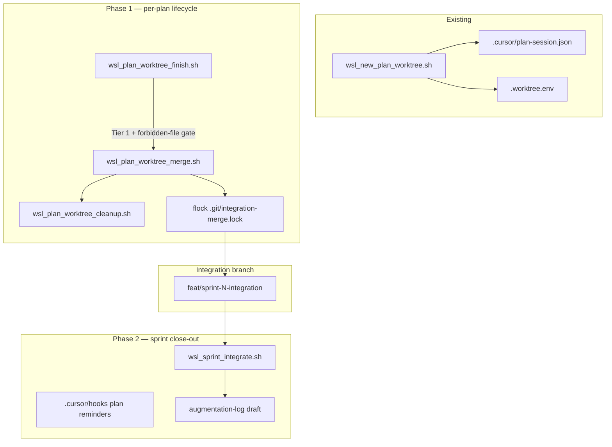

# Parallel Plans Lifecycle Scripts

Reference for the WSL2 scripts that guide a per-plan worktree from creation through merge into the sprint integration branch. All scripts follow the [WSL2 development rule](../.cursor/rules/wsl2-development.mdc): run from Ubuntu 24.04 (WSL2) or via the matching Windows launcher (`*.cmd` / `*.ps1`) which shells into WSL for you.

For the workflow context (three-layer branch model, port slots, ownership contract), read [parallel-plans-workflow.mdc](../.cursor/rules/parallel-plans-workflow.mdc) first. This document is the operator's reference for the shell tooling.

## Lifecycle diagram



## Script reference

Every lifecycle script (finish, merge, cleanup, sprint-integrate) supports the common CLI conventions from Phase 8.2 of `.cursor/plans/parallel_plans_lifecycle_8f81133b.plan.md`:

- `-h` / `--help` — usage banner, expected env vars, example invocation
- `--version` — script version constant plus `git log -1 --format=%h scripts/` for the tree state
- `--dry-run` (merge / cleanup / sprint-integrate only) — prints planned actions with a `[dry-run]` prefix and takes no filesystem, git, or docker side effects
- `--yes` — non-interactive confirmation for prompts

`wsl_new_plan_worktree.sh` predates the convention set and only supports `--help`; its Phase 1 update in the same plan adds the session-metadata writer without changing its argument surface.

### `wsl_new_plan_worktree.sh` (start)

| Field | Value |
|---|---|
| Run from | Main worktree (slot 0), i.e. `C:/Nagarro/ai-avengers` |
| Launcher | [`new-plan-worktree.cmd`](../new-plan-worktree.cmd) / `.ps1` |
| Purpose | Create a git worktree on a new branch, allocate a slot's port pair, write `.worktree.env` and `.cursor/plan-session.json`, seed the plan file from the template |
| Args | `<branch> <slot> [--base <base-branch>]` |
| Env vars | (none required — the script writes `FLUTTER_PORT`/`DOCKER_PORT` into `.worktree.env` for the new worktree) |
| Exit codes | `0` created worktree · `1` invalid args, slot already in use, branch collision, or unresolved base |

### `wsl_plan_worktree_finish.sh` (finish)

| Field | Value |
|---|---|
| Run from | Per-plan worktree (linked worktree, not main) |
| Launcher | `plan-worktree-finish.cmd` / `.ps1` |
| Purpose | Gate the branch before merge: Tier 1, dirty-tree check, forbidden-file gate against `parallel-agents.mdc`, secret scan, patch-notes parser; flips session `ready:true` on pass |
| Args | `[--push] [--ship] [--yes] [-h\|--help] [--version]` (`--dry-run` intentionally not supported — finish is a read-only gate already) |
| Env vars | `FLUTTER_PORT` and `DOCKER_PORT` sourced from `.worktree.env` (must not equal 3000 / 8080); optional `gitleaks` on `$PATH` for the secret scan. With `--ship`, runs `wsl_tier2_smoke.sh` (teardown) after gates; with `--ship --push`, opens MR via `wsl_open_mr.sh` instead of bare push |
| Exit codes | `0` gate green, session ready · `1` Tier 1 fail, dirty tree, forbidden-file hit, secret scan hit, Tier 2 smoke fail, or version-gate fail |

### `wsl_plan_worktree_merge.sh` (merge)

| Field | Value |
|---|---|
| Run from | Main worktree only |
| Launcher | `plan-worktree-merge.cmd` / `.ps1` |
| Purpose | Serialize integration merges via `flock`, run pre-flight (disk / fsck / remote-sync), snapshot reflog, merge `--no-ff`, run grep guardrails and Tier 1 on integration, prompt for patch-note application, push integration |
| Args | `<branch> [--base <integration>] [--yes] [--resume] [--dry-run] [--force-behind] [-h\|--help] [--version]` |
| Env vars | Reads session file from linked worktree; falls back to `--base` argument if the session file is missing. `PLAN_LIFECYCLE_QUIET=1` suppresses launcher toasts |
| Exit codes | `0` merged, guardrails and Tier 1 green · `1` lock timeout, pre-flight fail, grep guardrail fail, Tier 1 fail, or interrupted (SIGINT records `interrupted` in the event log before exit) |

### `wsl_plan_worktree_cleanup.sh` (cleanup)

| Field | Value |
|---|---|
| Run from | Main worktree |
| Launcher | `plan-worktree-cleanup.cmd` / `.ps1` |
| Purpose | Refuse if the branch is not merged into `--base` or has unpushed commits; stop the worktree's Flutter / Docker, remove the worktree, delete the branch, prune. Frees the port slot for reuse |
| Args | `<branch> [--base <integration>] [--yes] [--force] [--dry-run] [-h\|--help] [--version]` |
| Env vars | (none — reads `FLUTTER_PORT` / `DOCKER_PORT` from the worktree's `.worktree.env` before removing it) |
| Exit codes | `0` worktree gone, slot freed · `1` branch not merged, unpushed commits without `--force`, or `git worktree remove` fail |

### `wsl_sprint_integrate.sh` (sprint-integrate)

| Field | Value |
|---|---|
| Run from | Main worktree on integration branch |
| Launcher | `sprint-integrate.cmd` / `.ps1` (optional `msg *` completion toast on Windows) |
| Purpose | Full Tier 1 + Tier 2 + coverage gate on integration, then drafts a single `hackathon-docs/augmentation-log.md` entry (with duration rollup from `.cursor/plan-lifecycle.log.jsonl`) and prompts to append |
| Args | `[--base <integration>] [--yes] [--dry-run] [-h\|--help] [--version]` |
| Env vars | Delegates to [`wsl_deploy.sh`](wsl_deploy.sh) and [`wsl_coverage.sh`](wsl_coverage.sh) — same env vars they honour. `PLAN_LIFECYCLE_QUIET=1` suppresses the launcher's `msg *` toast on managed Windows devices where the toast API is blocked |
| Exit codes | `0` integration branch validated end-to-end, draft written · `1` Tier 1, Tier 2, or coverage gate fail (log records the tier label) |

### Windows launcher convention

Every `.cmd` launcher mirrors [`dev-local.cmd`](../dev-local.cmd) / [`deploy-local.cmd`](../deploy-local.cmd):

- CRLF self-heal on the target `.sh` (`sed -i 's/\r$//' ...`) before invoking
- Executes `wsl -e bash -lc "cd /mnt/c/Nagarro/ai-avengers && bash scripts/<matching>.sh %*"`
- Propagates the WSL exit code via `if errorlevel 1 exit /b 1`
- `sprint-integrate.cmd` additionally fires `msg %USERNAME% /TIME:10 "..." 2>NUL` on success unless `PLAN_LIFECYCLE_QUIET=1`

The `.ps1` mirrors call the same WSL command via `wsl.exe` and use `$LASTEXITCODE`.

### `wsl_tier2_smoke.sh` (Tier 2 verify)

| Field | Value |
|---|---|
| Run from | Any worktree (source `.worktree.env` in plan worktrees for port overrides) |
| Purpose | Build web release, docker/nginx smoke, deep-link verification (`/`, `/session/s-001`, `/directions?session=s-001`, `/connect/abc123`), coverage gate |
| Args | (none — env-driven) |
| Env vars | `TEARDOWN` — `1` stops docker after smoke (ship-branch); `0` leaves container running (deploy-local). `DOCKER_PORT`, `CONNECT_SAMPLE_TOKEN` |
| Exit codes | `0` smoke green · `1` build, docker, URL, or coverage fail |

Delegated by [`wsl_deploy.sh`](wsl_deploy.sh) (`TEARDOWN=0`) and [`wsl_ship_branch.sh`](wsl_ship_branch.sh) (`TEARDOWN=1`).

### `wsl_ship_branch.sh` (ship-branch)

| Field | Value |
|---|---|
| Run from | Feature branch worktree (not `main`) |
| Launcher | [`ship-branch.cmd`](../ship-branch.cmd) / [`ship-branch.ps1`](../ship-branch.ps1) |
| Purpose | Pre-review pipeline: Tier 1 → Tier 2 smoke (teardown) → push → idempotent GitLab MR |
| Args | `[--dry-run] [--no-tier2] [--no-mr] [--allow-dirty] [--yes] [-h\|--help] [--version]` |
| Env vars | `MR_TARGET` (default `main`), `DOCKER_PORT` / `FLUTTER_PORT` from `.worktree.env` when present |
| Exit codes | `0` shipped · `1` branch guard, dirty tree, Tier 1/2, push, or MR fail |

### `wsl_open_mr.sh` (GitLab MR)

| Field | Value |
|---|---|
| Run from | Feature branch (after push, or standalone with push) |
| Purpose | Idempotent MR to GitLab: `glab` when authenticated, else `git push` merge-request options |
| Args | `[--target <branch>] [--title <text>] [--draft] [--skip-push] [--yes] [-h\|--help] [--version]` |
| Env vars | `MR_TARGET` (default `main`) |
| Exit codes | `0` MR exists or created · `1` on default branch, no remote, or MR create fail |

**glab setup (one-time, local):** `glab auth login` — token via env; never commit credentials.

### When to use dev-local vs deploy-local vs ship-branch

| Goal | Command |
|------|---------|
| Fast UI iteration | `dev-local.cmd` (Flutter :3000, no Docker) |
| Manual Tier 2 smoke with container left running | `deploy-local.cmd` |
| Ready for review: validate + push + MR | `ship-branch.cmd` |
| Plan worktree ready + MR to integration | `plan-worktree-finish.cmd --push --ship` with `MR_TARGET=feat/sprint-N-integration` |

## Common failure modes and fixes

The failure/success banner of each script prints the rollback command relevant to its stage; the same recipes are consolidated here (from Phase 8.11 of the plan) so an operator can find them without re-running the failing script.

### merge failure

```bash
git merge --abort
# or, if the merge already committed:
git reset --hard ORIG_HEAD
git reflog show feat/sprint-N-integration
```

The reflog snapshot written by `wsl_plan_worktree_merge.sh` at `/tmp/lifecycle-merge-<branch>-reflog-<ts>.txt` also lists the pre-merge tip.

### push failure after merge (integration diverged remotely)

```bash
git reset --hard ORIG_HEAD@{1}
```

`ORIG_HEAD@{1}` is the state before the failed merge commit. After the reset, re-run `wsl_plan_worktree_merge.sh` — the pre-flight remote-sync check will now detect the divergence up front and fail cleanly instead of at push time. Pass `--force-behind` only after inspecting `git log origin/<base>..<base>`.

### cleanup mistake (removed a worktree you still wanted)

```bash
git checkout -b <branch> <sha-from-reflog>
git worktree add ../ai-avengers-<slug> <branch>
```

`<sha-from-reflog>` comes from `git reflog show <branch>` — cleanup deletes the branch but the reflog keeps the tip SHA for at least 30 days. Re-source `.worktree.env` in the recreated worktree.

### integrate Tier 2 failure (docker or coverage gate)

```bash
docker compose down
fuser -k ${DOCKER_PORT}/tcp
git status
```

Then re-run `sprint-integrate.cmd`. If the coverage gate is the blocker, see [`wsl_coverage.sh`](wsl_coverage.sh) for per-directory thresholds and override env vars.

### stale merge lock

The lockfile at `.git/integration-merge.lock` embeds `PID`, `HOST`, `STARTED_AT`, `COMMAND`. `wsl_plan_worktree_merge.sh` auto-clears when the recorded PID is dead **and** the `HOST` matches **and** age > 6 h. To manually clear when you're sure no other merge is running:

```bash
cat .git/integration-merge.lock   # inspect ownership first
rm .git/integration-merge.lock
```

### Ctrl+C mid-merge

The `INT TERM EXIT` trap in `wsl_plan_worktree_merge.sh` releases the flock, best-effort `docker compose down`, and emits an `interrupted` event to the log before exit. If Cursor / the shell was killed hard and the lock did survive, follow the stale merge lock recipe above.

## Cursor hook reminders (opt-in)

`.cursor/hooks/plan-lifecycle-reminder.sh` injects non-blocking chat reminders for worktree start/finish. Two-layer control:

1. **Registration** — `.cursor/hooks.json` presence controls whether Cursor registers the hook. The file is git-ignored (per-worktree); the tracked source is `.cursor/hooks.json.template`. The main worktree has no `hooks.json` → no hook fires → no popup. `new-plan-worktree.cmd` copies the template into each new plan worktree automatically.
2. **Content** — `.cursor/plan-lifecycle.json` `enabled` controls whether the hook emits reminder text (secondary switch).

| File / env | Role |
|---|---|
| `.cursor/hooks.json.template` | Tracked source of truth for hook registration |
| `.cursor/hooks.json` | Per-worktree registration (git-excluded; copied by `new-plan-worktree.cmd`) |
| `.cursor/plan-lifecycle.json` | Committed default — `"enabled": false` |
| `.cursor/plan-lifecycle.local.json` | Optional per-developer override (git-excluded) |
| `PLAN_LIFECYCLE_ENABLED=1` | One-shot env override |

**Enable reminders in a plan worktree:** run `new-plan-worktree.cmd` (copies `hooks.json.template` and writes `enabled: true` in `plan-lifecycle.json`).

**Pre-existing plan worktrees** (created before this change): run once inside that worktree:

```bash
cp .cursor/hooks.json.template .cursor/hooks.json
```

Optional keys: `remind_on_prompt` (before prompts that mention `.cursor/plans/*.plan.md`) and `remind_on_stop` (after agent turns when `plan-session.json` has `ready: false`). Both default to `true` when lifecycle is enabled.

**Auto-continue (long plans):** set `auto_continue: true` in `plan-lifecycle.json` (enabled by default in new plan worktrees). Agents maintain `.cursor/plan-checkpoint.json` per `.cursor/plan-checkpoint.schema.json`; `plan-auto-continue.sh` injects context on prompt and `followup_message` on `stop` / `subagentStop` when `remaining` is non-empty. See `.cursor/rules/plan-auto-continue.mdc`.

## Event log — `.cursor/plan-lifecycle.log.jsonl`

Every lifecycle script emits append-only JSON lines to `.cursor/plan-lifecycle.log.jsonl` in the main worktree. The file is git-excluded via the worktree's `info/exclude` (same pattern as `.worktree.env`) and never committed.

**Sample line**

```json
{"ts":"2026-07-11T07:12:03Z","script":"merge","phase":"grep_guardrails","branch":"feat/plan-security","action":"pass","duration_ms":420,"exit_code":0}
```

**Fields**

| Key | Meaning |
|---|---|
| `ts` | ISO-8601 UTC timestamp at phase completion |
| `script` | Short name: `start` / `finish` / `merge` / `cleanup` / `integrate` |
| `phase` | Sub-step, e.g. `tier1`, `forbidden_file_gate`, `grep_guardrails`, `secret_scan`, `lock_acquire`, `interrupted` |
| `branch` | Per-plan branch or integration branch, whichever the script is operating on |
| `action` | `pass` / `fail` / `skip` / `interrupted` |
| `duration_ms` | Wall clock for that phase (from `SECONDS` snapshots) |
| `exit_code` | Script exit code at emission time (0 while running; final value on the last line) |

**Manual rotation policy (no auto-rotate)**

Rotate when the file reaches **10 MB** or **30 days** since last rotation, whichever comes first:

```bash
# Run inside WSL from C:/Nagarro/ai-avengers:
mv .cursor/plan-lifecycle.log.jsonl \
   .cursor/plan-lifecycle.log.jsonl.$(date -u +%Y%m%d).bak
```

Kept-around backups are also git-excluded. Automation deliberately does not rotate on its own so a scripted merge run cannot mask log evidence of a bad merge behind a rotation.

**Sprint velocity rollup**

`wsl_sprint_integrate.sh` reads the log and groups `duration_ms` by `branch` / `phase` into the augmentation-log draft. If the file is missing (fresh clone, first run), the rollup section is written as `(no lifecycle events recorded for this sprint)` rather than failing.

## Cross-references

- [.cursor/rules/parallel-plans-workflow.mdc](../.cursor/rules/parallel-plans-workflow.mdc) — three-layer branch model, port slots, ownership contract, and the operator-facing Lifecycle scripts section
- [.cursor/rules/parallel-agents.mdc](../.cursor/rules/parallel-agents.mdc) — forbidden shared files enforced by the finish gate and the merge grep guardrails
- [.cursor/rules/local-wsl-auto-validation.mdc](../.cursor/rules/local-wsl-auto-validation.mdc) — Tier 1 / Tier 2 gates each lifecycle script delegates to
- [.cursor/rules/ship-branch.mdc](../.cursor/rules/ship-branch.mdc) — ship-branch pre-review pipeline (Tier 1 + Tier 2 teardown + push + MR)
- [.cursor/rules/wsl2-development.mdc](../.cursor/rules/wsl2-development.mdc) — WSL2 execution model for the `.sh` scripts and Windows `.cmd` launchers
- [.cursor/rules/ai-augmentation.mdc](../.cursor/rules/ai-augmentation.mdc) — how sprint-integrate drafts a single batched log entry
- [scripts/parallel-plans-lifecycle-test-matrix.md](parallel-plans-lifecycle-test-matrix.md) — manual PR-review checklist mirroring the automated bats tests
